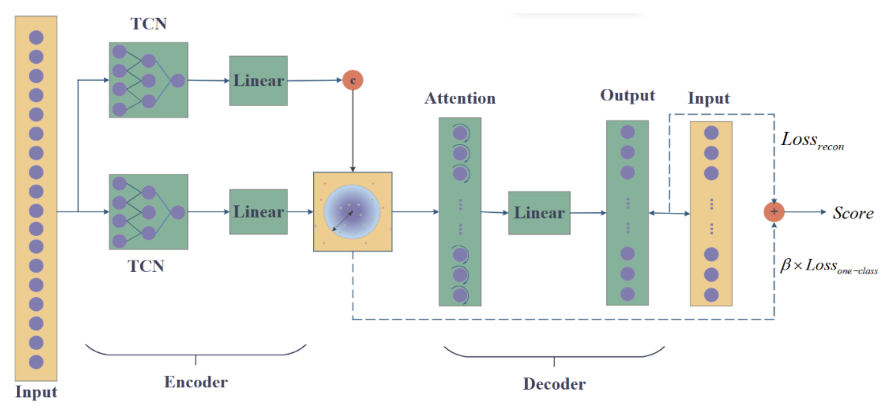
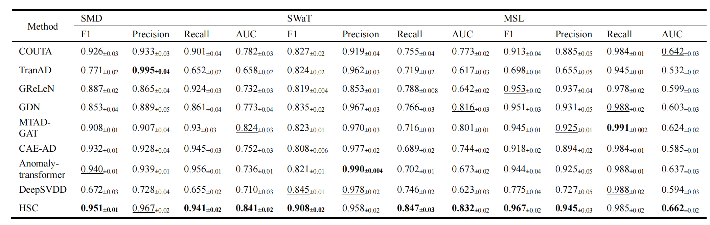
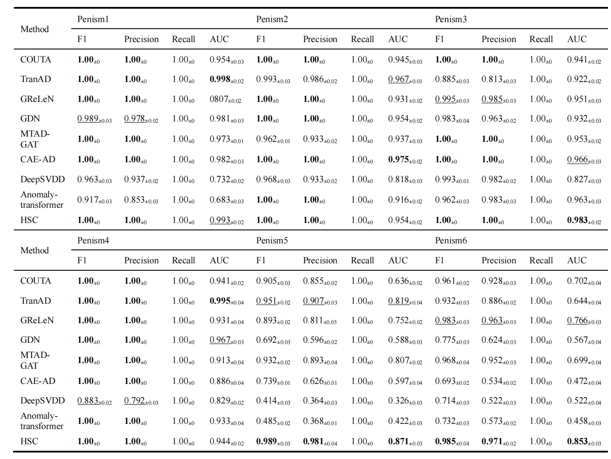

# HSC
This repository contains the implementation of the paper **HSC: One-Class Classification Constraint in Reconstruction Networks for Multivariate Time Series Anomaly Detection**.



## Datasets
The datasets used in this paper can be found in the following sources:

1. **MSL (Mars Science Laboratory rover)**: [Detecting Spacecraft Anomalies Using LSTMs and Nonparametric Dynamic Thresholding](https://arxiv.org/pdf/1802.04431).
   
2. **SMD (Server Machine Dataset)**: [Robust Anomaly Detection for Multivariate Time Series through Stochastic Recurrent Neural Network](https://netman.aiops.org/wp-content/uploads/2019/08/OmniAnomaly_camera-ready.pdf).

3. **SWaT (Secure Water Treatment)**: [SWaT: a water treatment testbed for research and training on ICS security](https://ieeexplore.ieee.org/abstract/document/7469060).

## Requirements
The project requires Python version 3.12. The necessary packages are listed below:

```text
scikit-learn==1.4.2
numpy==1.26.4
torch==2.4.0
torch_geometric==2.5.3
tqdm==4.66.4
```

## Usage
The parameters for running the code are configured in the `config.yaml` file. To execute the project, use the following command:

```bash
python main.py
```

## Directory Structure

```text
├── checkpoints       # Directory for model checkpoints
│
├── config            # Configuration file for parameters
│
├── data              # Directory for data files
│
├── dataset           # Dataset loader
│
├── models            # Model architectures for HSC
│
├── tester            # Script for testing the model
│
├── trainer           # Script for training the model
│
├── util              # Utility functions directory
│
├── main.py           # Main script to run the project
│
└── README.md         # Project documentation
```

## Results



## Contact
For any problems, feel free to contact: lijiazhen_lalali@163.com
